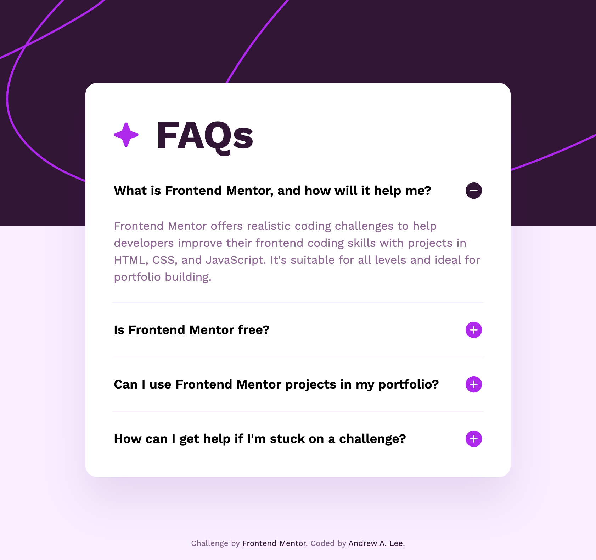

# Frontend Mentor - FAQ Accordion Solution

This is a solution to the [FAQ accordion challenge on Frontend Mentor](https://www.frontendmentor.io/challenges/faq-accordion-wyfFdeBwBz). Frontend Mentor challenges help you improve your coding skills by building realistic projects.

## Table of contents

- [Overview](#overview)
  - [The challenge](#the-challenge)
  - [Screenshot](#screenshot)
  - [Links](#links)
- [My process](#my-process)
  - [Built with](#built-with)
  - [Useful resources](#useful-resources)
- [Author](#author)
- [Acknowledgments](#acknowledgments)

## Overview

### The challenge

Users should be able to:

- Hide/Show the answer to a question when the question is clicked
- Navigate the questions and hide/show answers using keyboard navigation alone
- View the optimal layout for the interface depending on their device's screen size
- See hover and focus states for all interactive elements on the page

### Screenshot

### Links

- Solution URL: https://github.com/drewlee/pandelearnamonium/tree/main/cassess/projects/fementor/faq-accordion
- Live Site URL: https://drewlee.github.io/pandelearnamonium/cassess/projects/fementor/faq-accordion/

## My process

### Built with

- Semantic HTML5 markup
- CSS custom properties
- Flexbox
- CSS Grid
- Mobile-first workflow
- React
- TypeScript
- Accessibility
- ESLint
- Stylelint

### Useful resources

- [ARIA Authoring Practices Guide - Accordion Pattern](https://www.w3.org/WAI/ARIA/apg/patterns/accordion/) - Specification for authoring an accessible web accordion.

## Author

- Website - [Andrew A. Lee](https://github.com/drewlee)
- Frontend Mentor - [@drewlee](https://www.frontendmentor.io/profile/drewlee)
