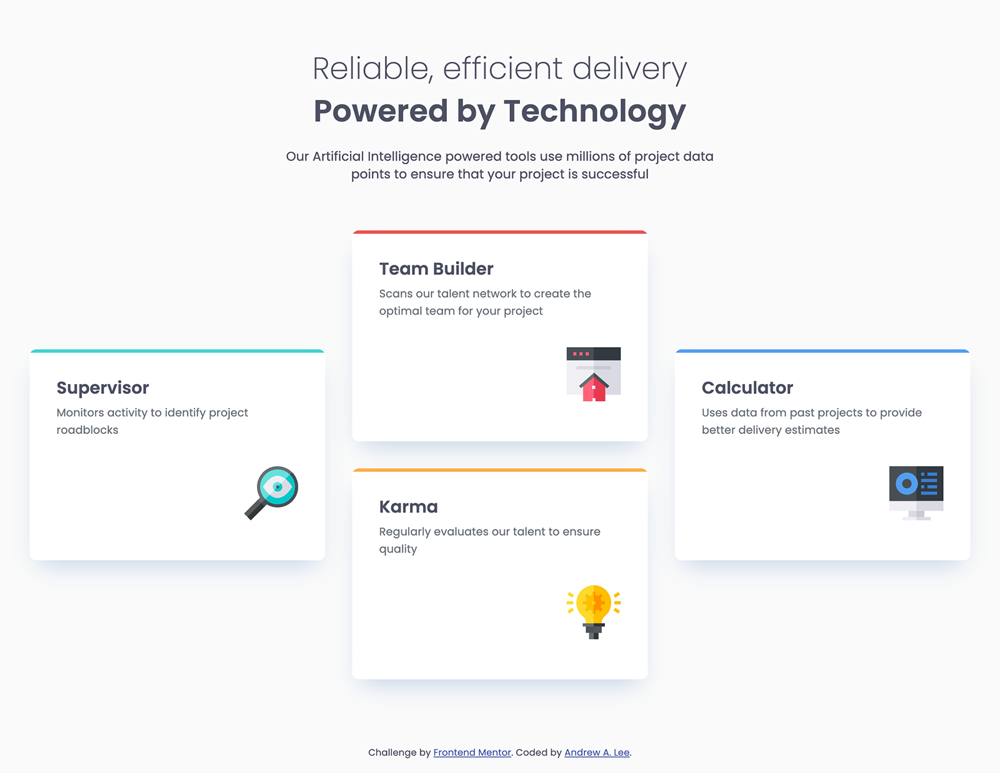

# Frontend Mentor - Four Card Feature Section Solution

This is a solution to the [Four card feature section challenge on Frontend Mentor](https://www.frontendmentor.io/challenges/four-card-feature-section-weK1eFYK). Frontend Mentor challenges help you improve your coding skills by building realistic projects.

## Table of contents

- [Overview](#overview)
  - [The challenge](#the-challenge)
  - [Screenshot](#screenshot)
  - [Links](#links)
- [My process](#my-process)
  - [Built with](#built-with)
- [Author](#author)

## Overview

### The challenge

Users should be able to:

- View the optimal layout for the site depending on their device's screen size

### Screenshot

### Links

- Solution URL: https://github.com/drewlee/pandelearnamonium/tree/main/cassess/projects/fementor/four-card-feature-section
- Live Site URL: https://drewlee.github.io/pandelearnamonium/cassess/projects/fementor/four-card-feature-section/

## My process

### Built with

- Semantic HTML5 markup
- CSS custom properties
- Flexbox
- CSS Grid
- Mobile-first workflow
- Accessibility
- ESLint
- Stylelint

## Author

- Website - [Andrew A. Lee](https://github.com/drewlee)
- Frontend Mentor - [@drewlee](https://www.frontendmentor.io/profile/drewlee)
